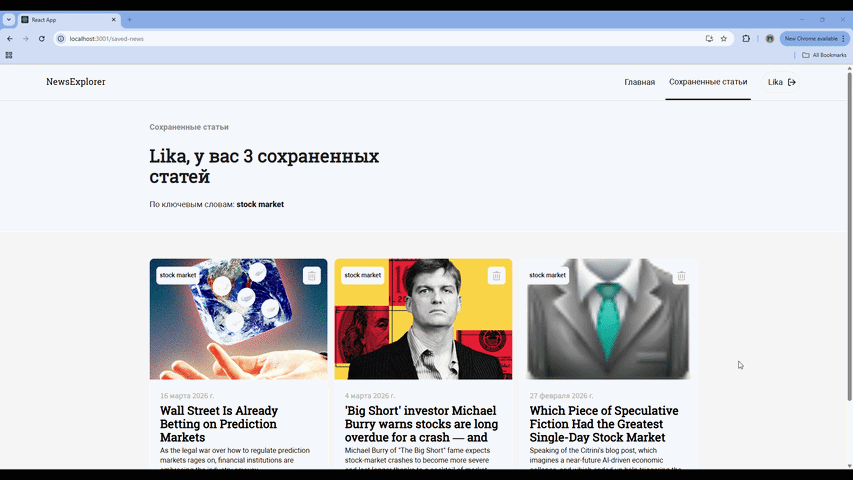

# News Explorer Frontend

News Explorer is a React application for searching news articles, reading results, and saving favorite articles to a personal account. The project includes authentication, protected routes, article search, saved articles management, and local persistence for search results.

This repository contains the frontend part of the project.

## What The App Does

- Search for news articles by keyword
- Register a new user
- Sign in and keep the user session with a token
- Save articles to a personal collection
- Delete saved articles
- Open a separate page for saved news
- Store the latest search query and found articles in `localStorage`

## Main Features

### Public area

- Landing page with a search form
- News search using an external news API
- Search results cards with article image, title, date, source, and description
- About section

### Authorized user area

- User registration and login popups
- Protected `/saved-news` route
- Save and remove articles
- Saved articles summary with keywords

## Technologies Used

- React 17
- React Router DOM 5
- JavaScript (ES6+)
- CSS
- BEM methodology for styling structure

## API Integration

### 1. News-explorer backend API

Configured to run locally on `http://localhost:3000`

Used for:

- registration
- login
- getting current user data
- loading saved articles
- creating saved articles
- deleting saved articles

### 2. External news API `https://nomoreparties.co/news`

Used for:

- searching news articles by keyword


## Local Storage Usage

The app stores some data in the browser:

- the last searched keyword
- the latest found articles list
- authentication token

This helps keep the interface state after page reloads.

## How To Run Locally

0. First, download news-explorer-api repo and run it locally. It should run on `http://localhost:3000`. 

1. Install dependencies:

```bash
npm install
```

2. Start the development server:

```bash
npm start
```

## Screenshots

### Main Page


### User Registration And Sign In


### Adding Articles


### Deleting Articles


